#### AIが書きました🤖
この記事は、AIが書いたものを人間が確認してから投稿しています。

Lauren Tan（@poteto）は、1か月で2,000件のプルリクエストを本番に出しました。講演「I Shipped 2000 PRs Last Month」[^1]の主題は、コードの書き方ではなく**AIへの信頼の作り方**です。本記事では、その内容をエンジニア以外の業務に読みかえます。

:::message
**凡例**
- 🔧 **Laurenの話**: 講演の内容（コード）
- 💼 **業務では**: 筆者による読みかえ（資料、メール、議事録など）
:::

# 結論: 信頼を積み上げた分だけ、AIに任せられる

> **AIを直すたびに、その修正を「二度と起きない形」で環境に残す。** 信頼はその積み重ねで増え、信頼が増えた分だけ、任せられるAIの数が増える。

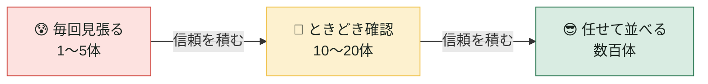

| | 🔧 Laurenの話 | 💼 業務では |
|---|---|---|
| 出発点 | 1〜5体に張りつき、逐一軌道修正する | AIの下書きを毎回すべて読み直す |
| 行き先 | 数百体のエージェントを並列に動かす | 複数の業務を任せて並べる |
| 分かれ目 | 信頼 | 信頼 |

Laurenは、信頼がないまま100体を動かしても、質の低い成果物と不具合が大量に出るだけだと述べています。数を増やす前に、信頼を増やす必要があります。

## あなたは料理長になる

Laurenは「ソフトウェア工場」という比喩を退け、**ミシュランの厨房**を選びました。

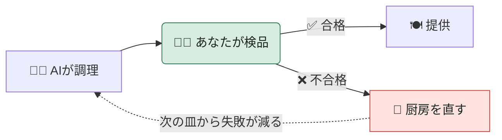

料理長は自分で食材を切りません。**皿を検品し、厨房を整えます。** 信頼を作るのは、後者の「厨房を直す」矢印です。

## 信頼を積む3つの柱

厨房を直す方法は、次の3つに整理できます。

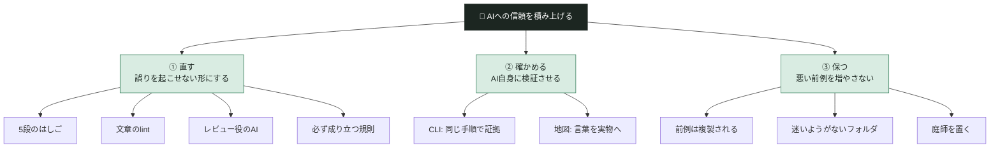

| 柱 | 問い | 信頼への寄与 |
|---|---|---|
| ① 直す | 同じ誤りをどう再発させないか | 誤りが減る |
| ② 確かめる | 人が見なくても正しいと言えるか | 確認の手間が減る |
| ③ 保つ | 整えた環境をどう汚さないか | 積んだ信頼が崩れない |

---

# ① 直す: 誤りを「起こせない」形にする

:::message
**この柱の結論**: 修正には5段の強さがある。**できるだけ上の段で直す**ほど、同じ誤りは再発しない。
:::

## 1-1. 5段のはしご

Laurenが「一つだけ持ち帰るなら、このスライド」と述べた図です。

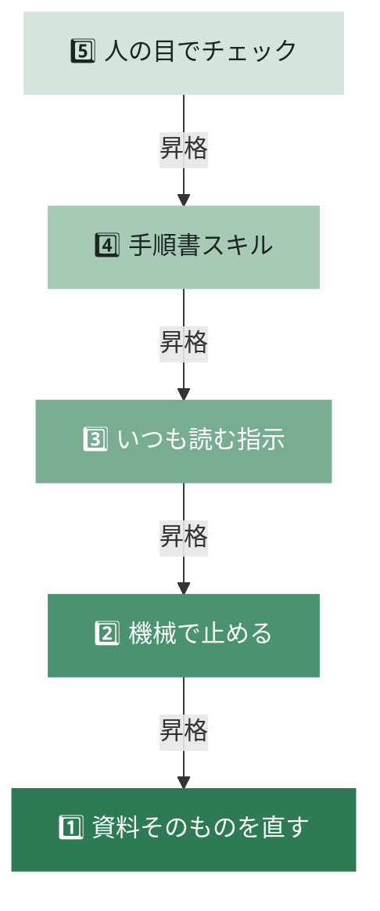

**上の段ほど確実。下の段は忘れられる。**

| 段 | 🔧 Laurenの話 | 💼 業務では | 強さ |
|:-:|---|---|:-:|
| 1 | codebase | テンプレートを直す。古い版を消す | ★★★★★ |
| 2 | lint / コンパイラ / CI | 入力規則、必須項目、下書き止まりの権限 | ★★★★☆ |
| 3 | rules / Bugbot | プロジェクト指示に書く。レビュー役のAI | ★★★☆☆ |
| 4 | skills | ベテランのやり方をスキルにする | ★★☆☆☆ |
| 5 | style guide | 毎回だれかが読む。**最後の手段** | ★☆☆☆☆ |

:::details なぜ1段目が最強なのか
Laurenの説明では、LLMはコンテキストにある既存のパターンを拡張します。読んだファイルはコンテキストの一部になるため、**コードベースそのものが最良の記憶**になります。業務でいえば、AIが参照するテンプレートや過去資料が、そのままAIの「お手本」になります。
:::

:::details なぜ5段目だけでは破綻するのか
PRの流入速度では、人が全行を読んで指摘し続けることは不可能になる、とLaurenは述べています。人のレビューは「何が足りないか」を発見する出発点としては有用ですが、見つけた誤りは上の段へ移す必要があります。
:::

## 1-2. 深掘り: 文章にも機械のチェックをかける（2段目）

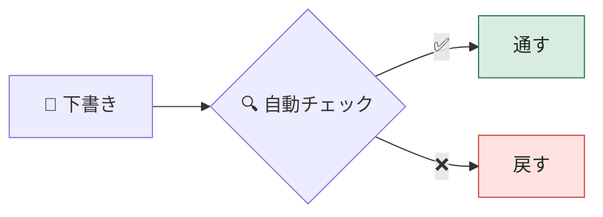

| 🔧 Laurenの話 | 💼 業務では | 例 |
|---|---|---|
| lint | 文章のlint | 表記ゆれ、禁止語、長すぎる文 |
| コンパイラ | 必須項目との照合 | 目的、期限、担当の欠落。数字の食い違い |
| CI | 毎回自動で実行 | 保存や変更のたびに走る |

:::message
**例**: 「emダッシュを使わない」をプロジェクト指示に書くだけなら3段目。lint に入れれば**2段目に上がる**。
:::

- **形式は lint、中身はAIレビュー。** 論理や提案の筋は機械で判定できない
- **前提は、成果物がテキストであること。** Markdownで書き、WordやスライドへはMarkdownから最後に変換する

## 1-3. 深掘り: 提出前に必ず見る「厳しい先輩」（3段目）

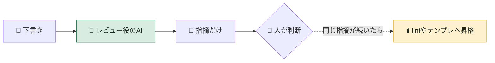

🔧 LaurenのチームのBugbotは、PRごとにAIがレビューし、不具合の疑いを指摘します。💼 業務では次の3点で再現できます。

1. **自動で動く**: 保存、送信、投稿の前に
2. **観点ファイル**: `REVIEW.md` にチームの目線を書く
3. **別のAIが見る**: 下書きを作ったAIとは別に

| 成果物 | 観点の例 |
|---|---|
| 提案書 | 課題、解決、価格の順か。数字に出典はあるか |
| メール | 宛先と添付は合っているか |
| 議事録 | 決定事項に担当と期限はあるか |
| 契約書 | 自社のひな形から外れていないか |

## 1-4. 深掘り: 「絶対に守る規則」を書いて確かめる（はしごの奥）

🔧 Laurenは、LeanやTLA+による形式検証を「最も難しく、未解決」の領域として挙げています。💼 業務では**道具は使わず、考え方だけ借ります。**

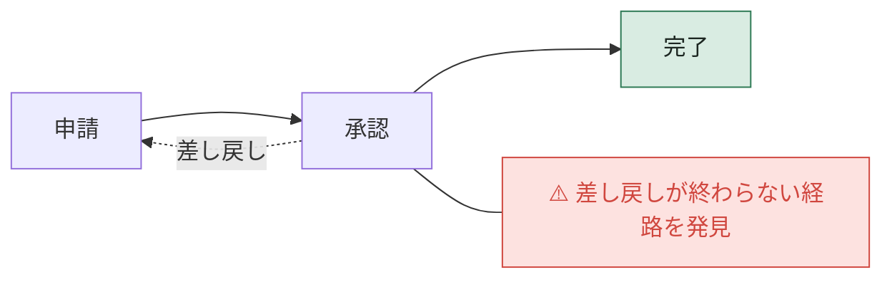

**迷路の道を全部歩いて、行き止まりを先に見つける。**

| 手段 | 例 |
|---|---|
| 決定表 | 金額×承認者を表で固定する |
| 入力規則 | 予算残のマイナスを表計算で禁止する |
| 検算スクリプト | 請求額＝見積合計を、AIが毎回確かめる |

---

# ② 確かめる: AIに「自分で検証する道具」を渡す

:::message
**この柱の結論**: AIが自分の仕事を証拠つきで確かめられれば、**人が毎回確認する必要が減る**。道具は **CLI** と **地図** の2つ。
:::

🔧 Laurenは当初、Chrome DevToolsで性能トレースを手作業で取り続けていました。その不満から、AIがアプリを起動してトレースを取る検証スキル（Control Glass）を作りました。試行錯誤の末、構成は2つに落ち着いています。

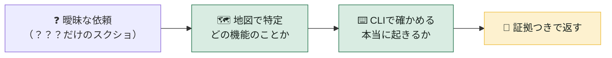

**地図とCLIがあれば、AIは推測しない。**

## 2-1. CLI: いつも同じ手順で、証拠を出す

🔧 AIがセッションごとに違うスクリプトを書くのではなく、スキルに同梱したCLIを毎回使う。これで手順が再現可能になります。

| 💼 業務のCLI | 何をするか |
|---|---|
| 見積の照合 | 単価をマスタと照合し、差分を出す |
| 最新の数字を取る | CRMや会計からAPIで取る。手で写さない |
| 出典を確かめる | URLを開き、引用が実在するか見る |
| 実物を開いて見る | PDFやスライドにして画面で確認する |

道具の候補: スキルに入れたスクリプト、MCPコネクタ、Apps Script。

## 2-2. 地図: 曖昧な言葉を実物に結びつける

🔧 Laurenのフィーチャーマップは、サイトマップから着想したものです。アプリに何があり、ユーザーがどうたどり着くかを記し、自動化で更新しています。

| 💼 業務の地図 | 中身 |
|---|---|
| 📖 用語集 | 「アクティブ顧客」などの定義 |
| 🕸️ エンティティ地図 | 顧客、案件、契約の関係と置き場所 |
| 🗺️ 業務マップ | 何をするには、どの画面、どのフォルダか |

:::message alert
**地図は自動で更新する。古い地図は、ないより危ない。**
:::

:::details はしごの上での位置
検証スキルは4段目（スキル）に属します。ただしCLIで手順を固定すると、2段目（機械で止める）に近い確実性が得られます。
:::

---

# ③ 保つ: 悪い前例を増やさない

:::message
**この柱の結論**: AIは前例を複製する。だから環境を**わざと窮屈に**し、**庭師**が手入れし続ける。
:::

## 3-1. 悪い見本はうつる

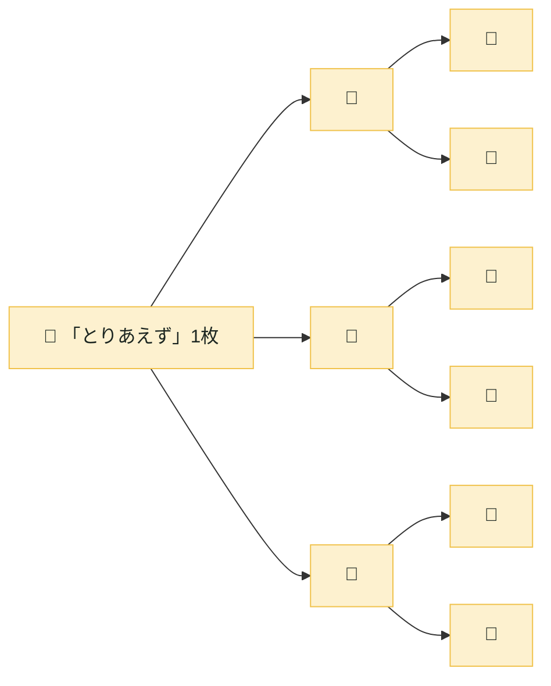

> コピーされるたびに、次のコピーが起きやすくなる。（Laurenのスライドより）

| | 🔧 Laurenの話 | 💼 業務では |
|---|---|---|
| 病原体 | コード内の回避策やコメント | 「暫定」「とりあえず」の資料 |
| 広がり方 | 数日から数週間で事実上の標準に | 気づけば全案件の標準形式に |
| 対策 | Duneでコメントを禁止 | 「暫定」を残さない |

:::details なぜLaurenはコメントまで禁止したのか
AIが、コードに残されたコメントを「根本解決をせず応急処置で済ませる理由」として使っていたためです。人間には無害に見える習慣でも、AIにとっては模倣の対象になります。
:::

## 3-2. 迷いようがない「案件フォルダ」

🔧 LaurenのチームのDuneは「近道がそのまま正しい道になる」ように作った、わざと窮屈なフレームワークです。💼 業務では、フォルダ、テンプレート、権限を同じ考え方で固定します。

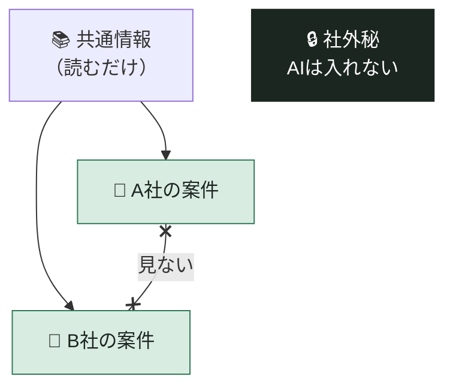

| 💼 規則 | 中身 | 🔧 Duneでは |
|---|---|---|
| 1案件＝1フォルダ | テンプレから一式を自動で作る | feature blueprint |
| 隣の案件は見ない | A社の条件がB社に混ざらない | プロセス境界 |
| 書き手は1人 | 価格は営業企画、条項は法務だけ | one value, one writer |
| AIは空欄を埋めるだけ | 単価や条項を推測しない | 薄いUIコンポーネント |
| 例外は決まった欄へ | 本文に「※今回だけ」を書かない | コメント禁止 |
| 機械で守る | 権限、保護範囲、必須項目チェック | import規則 |

- ✅ **並行で任せても衝突しない**: AI-AはA社、AI-BはB社。書く場所が重ならない
- ⚠️ **代償はベテランの窮屈さ**: それでも新人、他部署、AIは迷わない

:::details Duneのプロセス境界の実例
Electronのメインプロセス用のコードがレンダラーに紛れ込むと、描画が遅くなります。120fpsを保つには1フレームを約8ミリ秒に収める必要があります。Duneはこの境界を、importの依存グラフで機械的に強制しています。
:::

## 3-3. 庭師を置く

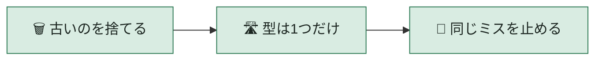

| 🔧 Laurenの話 | 💼 業務では |
|---|---|
| 技術的負債を削除する | 古い資料を捨てる |
| 舗装された一本道を保つ | テンプレートを1つに絞る |
| 悪いパターンを lint で禁止する | チェック項目を足す |

すぐに片付けられなくても、lint を書けば**少なくとも増殖は止まる**、とLaurenは述べています。

---

# ご褒美: 呼び鈴で動く厨房

3つの柱で信頼が積み上がると、AIを**自動で起動**できるようになります。

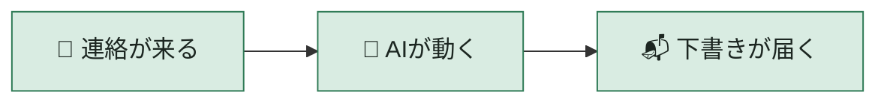

| 🔧 Laurenの話 | 💼 業務では |
|---|---|
| Grok BotがSlackやSentryを購読し、クラウドエージェントを起動 | Slack、メール、予定表をつなぎ、決まった時に自動で動く |
| 不具合報告を自動で再現し、「修正後は再現しない」と返す | 問い合わせに、証拠つきの下書きを自動で用意する |

:::message alert
順序を逆にしない。信頼のない環境で自動起動を増やしても、低品質な成果物が増えるだけ。
:::

---

# まとめ: 覚えるのは1つだけ

> ### AIを直したくなったら、「二度と起きない形」にできないか考える。

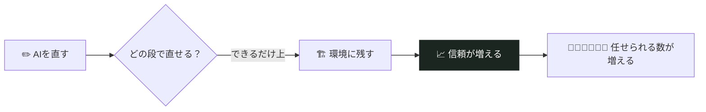

最初の一歩はこれだけです。

1. 直近でAIに入れた指摘を1つ選ぶ
2. 「テンプレートを直せば起きなくなるか」を問う
3. だめなら「機械で止められるか」を問う

Lauren自身、この積み重ねを「秘密ではなく、大量の地道な作業だ」と述べています。

[^1]: Lauren Tan（@poteto）「I Shipped 2000 PRs Last Month」講演（38分）: https://x.com/poteto/status/2102050467505430555
